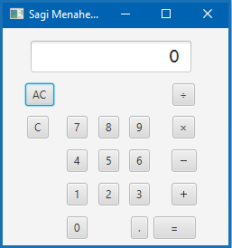
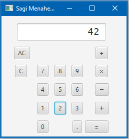

# Calculator-in-javaFX

This project is a JavaFX implementation of a basic calculator. The application provides a simple user interface with number input, arithmetic operations, and a display to show the calculation result.

Task #3.2 for the 20554 java course of the Open University

## Calculator Features

The calculator application includes the following features:

1. **Arithmetic Operations:** Addition, subtraction, multiplication, and division operations are supported.

2. **Number Input:** Users can input numbers and perform calculations using the provided buttons.

3. **Clear and Reset:** The "C" button clears the current input, and the "AC" button resets the calculator.

4. **Dynamic Display:** The display dynamically updates based on user input and calculations.

## Controller Class

The `Maman13Ex2Controller` class is responsible for handling user interactions and performing calculations. It includes methods for button clicks, initialization, and a static method for performing arithmetic calculations.

## Usage

To use this calculator application, follow these steps:

1. Run the application.
2. Input numbers using the numeric buttons.
3. Perform arithmetic operations using the corresponding buttons.
4. Press the "C" button to clear the current input or "AC" to reset the calculator.
5. View the calculation result on the display.

## Screenshots

